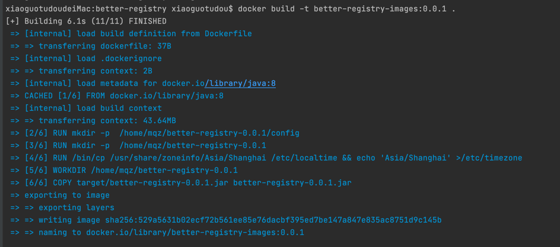
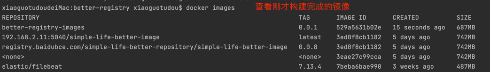

# better-registry for private repository

### 搭建private docker repository
````

 1. 构建registry的yml文件， ./docker-registry/docker-registry.yml ，后启动容器


 2. 若搭建registy的服务器没有配置https访问的话，因为docker1.3x后docker registry交互默认使用的是HTTPS
     因为私库没有配置https证书，所以是http的交互故而报错 ： 
            The push refers to repository [192.168.2.11:5040/nacos-gateway]
            Get https://192.168.2.11:5040/v2/: http: server gave HTTP response to HTTPS client
     
     解决办法： 
        macOS：
            
       
        其他：
            
````

### 推送镜像到私库：

````
 原始镜像：
    a. docker pull **
    b. 通过Dockerfile生成自己的镜像
       
 1. 把原始镜像打上私库的标签： docker tag 原始镜像:版本号 私库ip:端口/镜像名:版本号 ： 
    docker tag nginx:latest 192.168.2.11:5040/my-nginx:0.0.1
    
 2. 推送打好的镜像到私库：
    docker push 192.168.2.11:5040/my-nginx:0.0.1
 
````


### 私库管理API：
````
  1. 
  
````
  
  
  
  

````


        