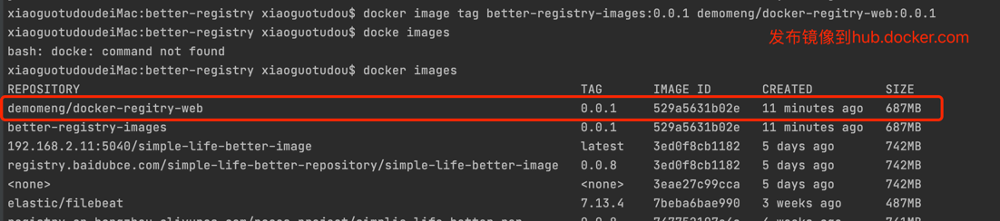
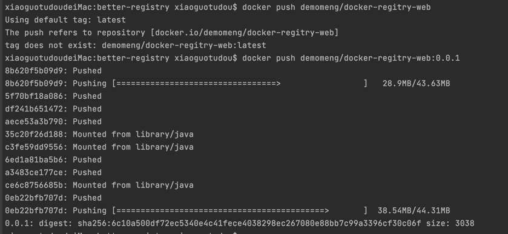
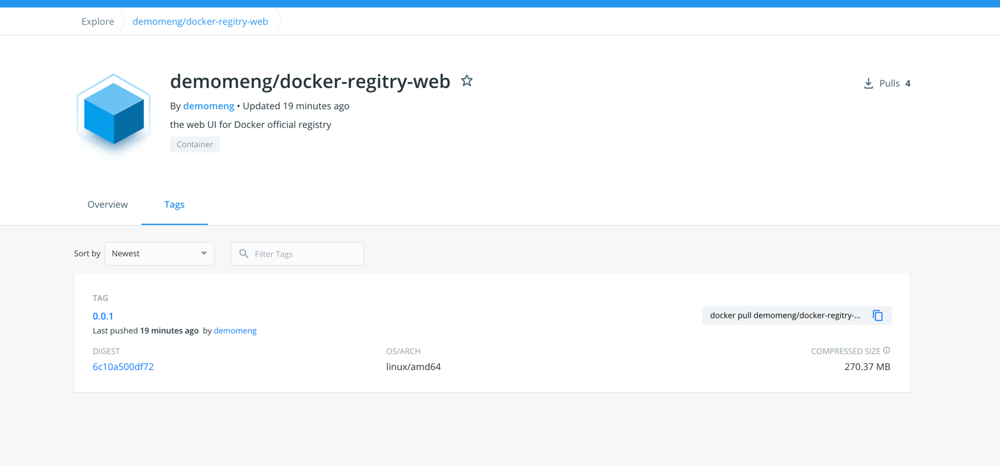

# better-registry for private repository

### 搭建private docker repository
````

 1. 构建registry的yml文件， ./docker-registry/docker-registry.yml ，后启动容器


 2. 若搭建registy的服务器没有配置https访问的话，因为docker1.3x后docker registry交互默认使用的是HTTPS
     因为私库没有配置https证书，所以是http的交互故而报错 ： 
            The push refers to repository [192.168.2.11:5040/nacos-gateway]
            Get https://192.168.2.11:5040/v2/: http: server gave HTTP response to HTTPS client
     
     解决办法： 
        macOS：
````

````
        其他：
````

````
### 推送镜像到私库：
````
 原始镜像：
    a. docker pull **
    b. 通过Dockerfile生成自己的镜像
       
 1. 把原始镜像打上私库的标签： docker tag 原始镜像:版本号 私库ip:端口/镜像名:版本号 ： 
    docker tag nginx:latest 192.168.2.11:5040/my-nginx:0.0.1
    
 2. 推送打好的镜像到私库：
    docker push 192.168.2.11:5040/my-nginx:0.0.1
 
````


### 私库管理API：
````
  1. 
  
````
  
  
  
  

````


### lombok对应springBoot版本：TODO

````

     1.18.6  ===> 2.1.4
     1.18.16 ===> 2.3.5.RELEASE  
     

````


### 制作镜像并且上传到公开库： demomeng/better-registry-web

    1. 制作镜像：
        前置条件： 
               springBoot项目，及外部配置文件(后续通过挂载容器内进行启动)
        a.基于Dockerfile构建一个jar的镜像，参考Dockerfile文件
        b.执行构建镜像： docker build -t better-restry-images:0.0.1


    2. 发布镜像： 和发布到私库registry一致
        前置条件：
                在hub.docker.com 上新建好对应的仓库及撰写overview
        a. 把本地镜像打成预上传的镜像：  docker image tag better-registry-images:0.0.1 demomeng/docker-regitry-web:0.0.1


        b. 推送到hub.docker.com: docker push demomeng/docker-regitry-web


     3. 完成： 


     4. 后续： 
           在别的服务器上使用该镜像，构建好docker-better-registry.yml文件即可
           注意： 
                需要修改镜像地址！！


        